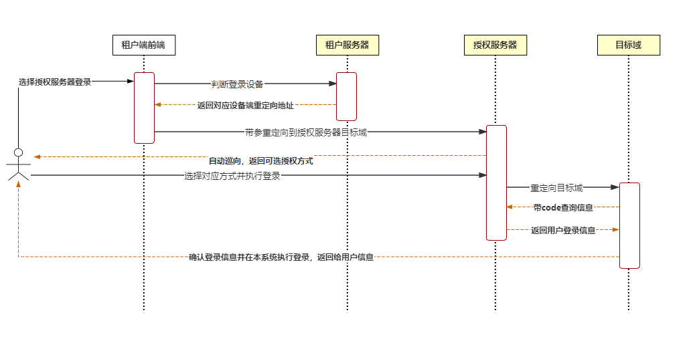
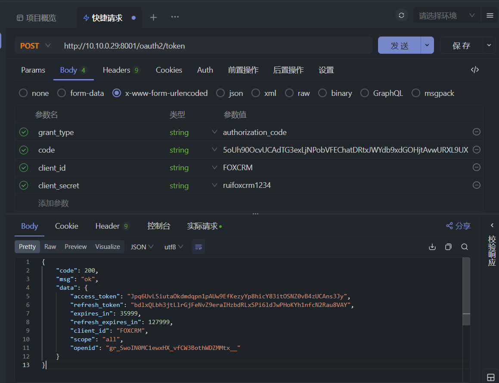
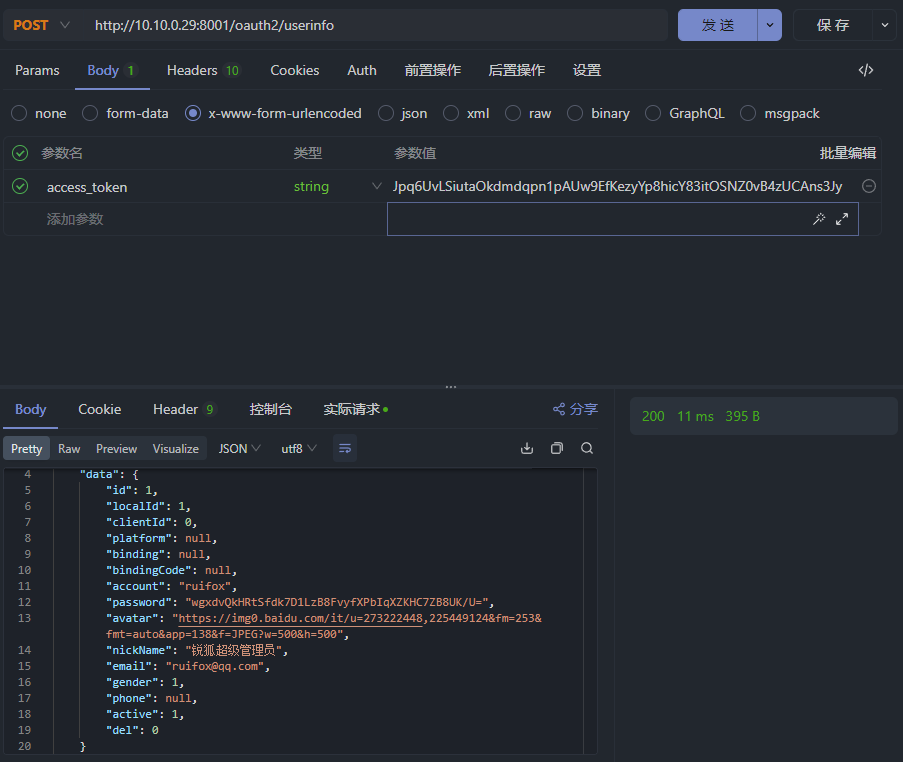

## 授权服务器租户端对接文档

> 锐狐授权服务器是完全基于国产化上层框架的多租户一体化授权服务器。项目基于二级链路的三方授权和自动巡向的租户扩展，同时支持`授权校验页SSR`

项目目前优先支持`授权码模式`和`简化授权码模式`，这是Oauth2协议中高频使用的两个模式。

### 1.1 授权流程

> 从这里开始，将介绍授权服务的整个体系流程

#### 1.1.1 信息登记

1.寻找`锐狐授权服务器管理员`，在管理员处申请授权服务器的使用资格，你需要提供：

| 字段名              | 字段                  | 备注                                                     |
| ------------------- | --------------------- | -------------------------------------------------------- |
| 租户端系统识别码    | client_id             | 选填，不填则为系统首拼                                   |
| 租户端密码          | client_secret         | 选填，不填则为随机乱码                                   |
| 租户端图标          | client_icon           | 选填，不填则为默认图标                                   |
| 授权范围            | contract_scope        | 选填，不填则为all                                        |
| 可选重定向地址      | allow_url             | 必填，多个请用半角逗号隔开                               |
| 开启授权码模式      | is_code               | 必填，0否1是                                             |
| 开启简化授权码模式  | is_implicit           | 必填，0否1是                                             |
| 开启密码模式        | is_password           | 必填，0否1是                                             |
| 开启客户端模式      | is_client             | 必填，0否1是                                             |
| 开启静默授权        | is_auto_mode          | 必填，0否1是，单次登录状态首次授权后，之后的授权不再询问 |
| 是否开启刷新token   | is_new_fresh          | 必填，0否1是                                             |
| token存续时长       | access_token_timeout  | 必填，token过期时长                                      |
| 刷新token存续时长   | refresh_token_timeout | 必填，刷新token过期时长                                  |
| 客户端token存续时长 | client_token_timeout  | 必填，客户端token过期时长                                |

2.你将收到回执如下：

| 字段名           | 字段          |
| ---------------- | ------------- |
| 租户端系统识别码 | client_id     |
| 租户系统编号     | id            |
| 租户端系统密码   | client_secret |

#### 1.1.2 三方授权接入登记

> 在这里，你需要提供所有可能用到的三方授权服务。

下边以**企业微信**为例，你需要提供：

| 字段名                     | 字段        | 备注                       |
| -------------------------- | ----------- | -------------------------- |
| 三方授权渠道               | channel     | 必填，比如企微、QQ、飞书等 |
| 租户端系统编号             | client_id   | 必填，对应上述返回的id     |
| 三方授权系统给的corpid     | corp_id     |                            |
| 三方授权系统给的corpsecret | corp_secret |                            |
| 三方授权系统给的app编号    | appid       |                            |

> 授权信息登记完毕以后，进入`代码编写`阶段
>
> 请注意，以下代码仅作参考使用。

#### 1.1.3 系统交互逻辑分析

下方给出时序图，方便理解：



#### 1.1.4 配置实例

配置文件示例配置如下，以后的授权均采用如下配置进行

```yaml
oauth2:
  client:
  #租户系统账号
    clientId: FOXCRM
    #租户系统密码
    clientSecret: ********
    #租户系统授权模式
    grantType: authorization_code
    #租户系统返回模式
    responseType: code
    #重定向地址
    redirectUri: http://your.network.path/PC
    redirectUri-mobile: http://your.network.path/PE
    #授权服务器token获取地址
    accessTokenUri: http://ram.system.path/oauth2/token
    #授权服务器登录地址
    userLoginUri: http://ram.system.path/oauth2/authorize
    #授权服务器授权地址
    userAuthorizationUri: http://ram.system.path/oauth2/authorize
    #用户信息地址
    userInfoUri: http://ram.system.path/oauth2/userinfo
    #系统权限标识
    scope: all
```


#### 1.1.5 前端获取ram地址

在这一步中，后端的主要目的是：给前端`授权服务器`重定向地址。

前端在这一步需要返回用户目前在手机端还是PC端，或者其他端。如果网站做了响应式，这一步可以省略，直接返回同一个地址就行了。

比如说，给定前端一个这样的接口：前端只需要传入是否是手机端即可。

```java
    @ApiOperation("获取RAM授权登录地址")
    @GetMapping("/oauth/url")
    public ResponseResult<?> oauthRedirect(HttpServletRequest request,Boolean isMobile){
        return authService.oauthRedirect(request,isMobile);
    }
```

后端处理代码可以这样子做：

> 注意，其中的相关变量已经提前注入，详情看`1.1.4 配置文件示例`

```java
    public String getUrlToOauthCenter(Boolean isMobile){
        if (isMobile==null || !isMobile){
            return userLoginUri+"?response_type="+responseType+"&client_id="+clientId+"&redirect_uri="+redirectUri+"&scope="+scope+"&authorizationUri="+userAuthorizationUri;
        }else {
            return userLoginUri+"?response_type="+responseType+"&client_id="+clientId+"&redirect_uri="+redirectUriMobile+"&scope="+scope+"&authorizationUri="+userAuthorizationUri;
        }
    }
```

#### 1.1.6 前端执行重定向

在这一步，我们拿到了1.1.5章节中的重定向地址，重定向到了RAM系统。此时地址栏期望的URL如下：

`http://ram.mynetworks.net/oauth2/authorize?response_type=code&client_id=FOXCRM&redirect_uri=http://crm.mynetworks.net/&scope=all&authorizationUri=http://ram.mynetworks.net/oauth2/authorize`

> 到这里，所有的登录操作已经被授权服务器接管

#### 1.1.7 授权码回调

如1.1.6所示，系统在跳转授权服务器并且成功登录后，系统期望重定向至`redirect_uri`变量下的目标URL，因此，当用户操作完成后，系统会重定向到：`https://crm.mynetworks.net/?code=5oUh90OcvUCAdTG3exLjNPobVFEChatDRtxJWYdb9xdGOHjtAvwURXL9UXmG`

其中，code变量后跟随的是授权码

#### 1.1.8 消费授权码

访问`accessTokenUri`对应的地址，携带`code`、`授权模式`、`客户端账密`进行访问`token接口`,换取token



#### 1.1.9 获取用户信息

在上一步，获取到的token其实本质上是`用户在授权服务器的通行令牌`。那么我们只需要通过这个token，去获取到用户的账户信息即可。

由此可以得到下一步的操作：

访问`userInfoUri`，在请求体中携带token进行访问



获得用户信息，此时交互完成。

### 1.2 租户侧注册登录流程

> 在获取到用户信息后，证明该用户拥有在oauth2协议下理论登录能力。此时不仅仅是为用户执行登录那么简单，还应该`让用户在系统内执行登录操作`

#### 1.2.1 用户信息比对

在用户信息被请求回系统后，应该对用户信息做一个比对处理，即用户是否已经注册到了系统中。

用户已经注册的，通过已经注册的绑定账号进行登录。

需要注意的是，`platfrom`字段会返回用户的登录平台，如果为`null`或`RAM`，则为通过授权服务器注册的账户。唯一的账号可以使用`电话号码`等。

#### 1.2.2 自动注册

如果通过1.2.1步骤发现用户尚未注册的，则通过自动注册、引导用户绑定等操作完成注册流程。

#### 1.2.3 执行自动登录

在系统中，`自动注册`、`发现用户已经注册`、`引导用户绑定注册`的，则立即执行登录操作。此时可以在登陆之前，为用户动态绑定一个默认角色或者默认权限，确保用户可以正常使用系统。

如果框架为`spring security`的，登录稍微麻烦一些，可以参考如下示例：

#### 1.2.4 security框架内执行自动登录示例

##### 1.2.4.1 重写 AbstractAuthenticationToken

> 在这里重写`AbstractAuthenticationToken`类，以将用户写入security上下文

```Java
public class OauthUserQuickLoginAuthenticationToken extends AbstractAuthenticationToken {

    private final LoginUser user;

    public OauthUserQuickLoginAuthenticationToken(LoginUser user) {
        super(null);
        this.user = user;
        setAuthenticated(false);
    }

    public OauthUserQuickLoginAuthenticationToken(LoginUser user, Collection<? extends GrantedAuthority> authorities) {
        super(authorities);
        this.user = user;
        setAuthenticated(true);
    }

    @Override
    public Object getCredentials() {
        return null;
    }

    @Override
    public Object getPrincipal() {
        return user;
    }
}
```

##### 1.2.4.2 用户信息封装到security上下文

> 利用1.2.4.1的方法，将用户信息初始化，然后写入安全上下文

```java
//        将用户手动重写到认证类内通过认证，写入安全上下文
        OauthUserQuickLoginAuthenticationToken authenticationToken = new OauthUserQuickLoginAuthenticationToken(loginUser);
        SecurityContextHolder.getContext().setAuthentication(authenticationToken);
```

##### 1.2.4.3 初始化用户

> 在写入安全上下文以后，正常执行用户手动登录的后续操作即可，返回用户的权限路由、角色、权限等，同时为用户颁发token即可

至此，锐狐授权服务器对接成功。